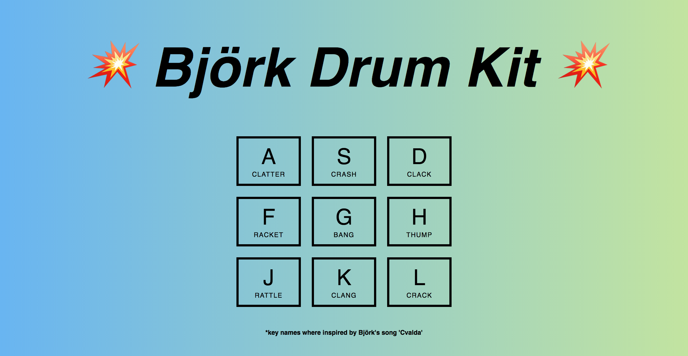

# Björk Drum Kit
Digital Drum Kit made with HTML, CSS and Vanilla JavaScript, first challenge from the #Javascript30 series. The idea for the key names comes from Björk's song 'Cvalda', from the soundtrack album 'Selmasongs'.

## The Stack

* HTML, CSS, Vanilla JavaScript

## Features

* Users can press one of the displayed letters and the corresponding sound and animation for that letter will play

## Learning Outcomes

* Learned about the 'transitionend' event
* How to stop and restart an audio clip
* Add and remove classes in Vanilla JavaScript

